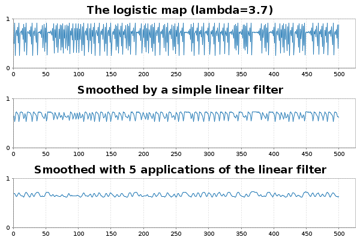
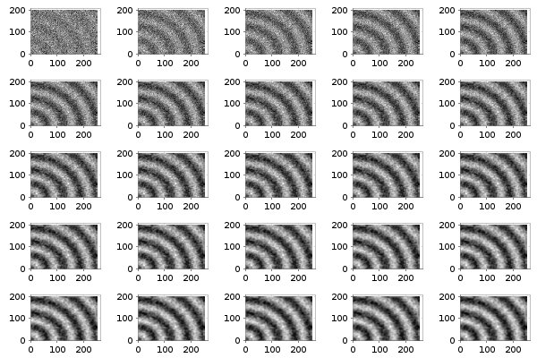

# Comonads for scientific and statistical computing in Scala

*This is a work-in-progress draft - final post will be posted on my wordpress.com blog*

## Introduction

In a [previous post](https://darrenjw.wordpress.com/2016/04/15/first-steps-with-monads-in-scala/) I've given a brief introduction to *monads* in Scala, aimed at people interested in scientific and statistical computing. Monads are a concept from category theory which turn out to be exceptionally useful for solving many problems in functional programming. But most categorical concepts have a *dual*, usually prefixed with "co", so the dual of a monad is the *comonad*. Comonads turn out to be especially useful for formulating algorithms from scientific and statistical computing in an elegant way. In this post I'll illustrate their use in signal processing, image processing, numerical integration of PDEs, and Gibbs sampling (of an Ising model). Comonads enable the *extension* of a *local computation* to a *global computation*, and this pattern crops up all over the place in statistical computing.

## Monads and comonads

Simplifying massively, from the viewpoint of a Scala programmer, a monad is a mappable (functor) type class augmented with the methods `pure` and `flatMap`:
```scala
trait Monad[M[_]] extends Functor[M] {
  def pure[T](v: T): M[T]
  def flatMap[T,S](v: M[T])(f: T => M[S]): M[S]
}
```
In category theory, the dual of a concept is typically obtained by "reversing the arrows". Here that means reversing the direction of the methods `pure` and `flatMap` to get `extract` and `coflatMap`, respectively.
```scala
trait Comonad[W[_]] extends Functor[W] {
  def extract[T](v: W[T]): T
  def coflatMap[T,S](v: W[T])(f: W[T] => S): W[S]
}
```
So, while `pure` allows you to wrap plain values in a monad, `extract` allows you to get a value out of a comonad. So you can always get a value out of a comonad (unlike a monad). Similarly, while `flatMap` allows you to transform a monad using a function returning a monad, `coflatMap` allows you to transform a comonad using a function which collapses a comonad to a single value. It is `coflatMap` (sometimes called `extend`) which can extend a local computation (producing a single value) to the entire comonad. We'll look at how that works in the context of some familiar examples.

## Applying a linear filter to a data stream

One of the simplest examples of a comonad is an *infinite* stream of data. I've discussed streams in a [previous post](https://darrenjw.wordpress.com/2017/04/01/mcmc-as-a-stream/). By focusing on infinite streams we know the stream will never be empty, so there will always be a value that we can `extract`. Which value does `extract` give? For a `Stream` encoded as some kind of lazy list, the only value we actually know is the value at the head of the stream, with subsequent values to be lazily computed as required. So the head of the list is the only reasonable value for `extract` to return.

Understanding `coflatMap` is a bit more tricky, but it is `coflatMap` that provides us with the power to apply a non-trivial statistical computation to the stream. The input is a function which transforms a stream into a value. In our example, that will be a function which computes a weighted average of the first few values and returns that weighted average as the result. But the return type of `coflatMap` must be a stream of such computations. Following the types, a few minutes thought reveals that the only reasonable thing to do is to return the stream formed by applying the weighted average function to all sub-streams, recursively. So, for a `Stream` `s` (of type `Stream[T]`) and an input function `f: W[T] => S`, we form a stream whose head is `f(s)` and whose tail is `coflatMap(f)` applied to `s.tail`. Again, since we are working with an infinite stream, we don't have to worry about whether or not the `tail` is empty. This gives us our comonadic `Stream`, and it is exactly what we need for applying a linear filter to the data stream.

In Scala, [Cats](https://typelevel.org/cats/) is a library providing type classes from Category theory, and instances of those type classes for parametrised types in the standard library. In particular, it provides us with comonadic functionality for the standard Scala `Stream`. Let's start by defining a stream corresponding to the [logistic map](https://en.wikipedia.org/wiki/Logistic_map).
```scala
import cats._
import cats.implicits._

val lam = 3.7
def s = Stream.iterate(0.5)(x => lam*x*(1-x))
s.take(10).toList
// res0: List[Double] = List(0.5, 0.925, 0.25668749999999985,
//  0.7059564011718747, 0.7680532550204203, 0.6591455741499428, ...
```
Let us now suppose that we want to apply a [linear filter](https://en.wikipedia.org/wiki/Linear_filter) to this stream, in order to smooth the values. The idea behind using comonads is that you figure out how to generate *one* desired value, and let `coflatMap` take care of applying the same logic to the rest of the structure. So here, we need a function to generate the *first* filtered value (since `extract` is focused on the head of the stream). A simple first attempt a function to do this might look like the following.
```scala
  def linearFilterS(weights: Stream[Double])(s: Stream[Double]): Double =
    (weights, s).parMapN(_*_).sum
```
This aligns each weight in parallel with a corresponding value from the stream, and combines them using multiplication. The resulting (hopefully finite length) stream is then summed (with addition).	We can test this with
```scala
linearFilterS(Stream(0.25,0.5,0.25))(s)
// res1: Double = 0.651671875
```
and let `coflatMap` extend this computation to the rest of the stream with something like:
```scala
s.coflatMap(linearFilterS(Stream(0.25,0.5,0.25))).take(5).toList
// res2: List[Double] = List(0.651671875, 0.5360828502929686, ...
```

This is all completely fine, but our `linearFilterS` function is specific to the `Stream` comonad, despite the fact that all we've used about it in the function is that it is a parallelly composable and foldable. We can make this much more generic as follows:
```scala
  def linearFilter[F[_]: Foldable, G[_]](
    weights: F[Double], s: F[Double]
  )(implicit ev: NonEmptyParallel[F, G]): Double =
    (weights, s).parMapN(_*_).fold
```
This uses some fairly advanced Scala concepts which I don't want to get into right now (I should also acknowledge that I had trouble getting the syntax right for this, and got help from Fabio Labella (@SystemFw) on the [Cats gitter channel](https://gitter.im/typelevel/cats)). But this version is more generic, and can be used to linearly filter other data structures than `Stream`. We can use this for regular `Streams` as follows:
```scala
s.coflatMap(s => linearFilter(Stream(0.25,0.5,0.25),s))
// res3: scala.collection.immutable.Stream[Double] = Stream(0.651671875, ?)
```
But we can apply this new filter to other collections. This could be other, more sophisticated, streams such as provided by [FS2](https://github.com/functional-streams-for-scala/fs2/), [Monix](https://monix.io/) or [Akka streams](https://doc.akka.io/docs/akka/current/stream/index.html?language=scala). But it could also be a non-stream collection, such as `List`:
```scala
val sl = s.take(10).toList
sl.coflatMap(sl => linearFilter(List(0.25,0.5,0.25),sl))
// res4: List[Double] = List(0.651671875, 0.5360828502929686, ...
```
Assuming that we have the [Breeze](https://darrenjw.wordpress.com/2013/12/30/brief-introduction-to-scala-and-breeze-for-statistical-computing/) scientific library available, we can plot the raw and smoothed trajectories.
```scala
def myFilter(s: Stream[Double]): Double =
  linearFilter(Stream(0.25, 0.5, 0.25),s)
val n = 500
import breeze.plot._
import breeze.linalg._
val fig = Figure(s"The (smoothed) logistic map (lambda=$lam)")
val p0 = fig.subplot(3,1,0)
p0 += plot(linspace(1,n,n),s.take(n))
p0.ylim = (0.0,1.0)
p0.title = s"The logistic map (lambda=$lam)"
val p1 = fig.subplot(3,1,1)
p1 += plot(linspace(1,n,n),s.coflatMap(myFilter).take(n))
p1.ylim = (0.0,1.0)
p1.title = "Smoothed by a simple linear filter"
val p2 = fig.subplot(3,1,2)
p2 += plot(linspace(1,n,n),s.coflatMap(myFilter).coflatMap(myFilter).coflatMap(myFilter).coflatMap(myFilter).coflatMap(myFilter).take(n))
p2.ylim = (0.0,1.0)
p2.title = "Smoothed with 5 applications of the linear filter"
fig.refresh
```


## Image processing and the heat equation

Streaming data is in no way the only context in which a comonadic approach facilitates an elegant approach to scientific and statistical computing. Comonads crop up anywhere where we want to extend a computation that is local to a small part of a data structure to the full data structure. Another commonly cited area of application of comonadic approaches is image processing (I should acknowledge that this section of the post is very much influenced by a blog post on [comonadic image processing](https://jaspervdj.be/posts/2014-11-27-comonads-image-processing.html) in Haskell). However, the kinds of operations used in image processing are in many cases very similar to the operations used in finite difference approaches to numerical integration of partial differential equations (PDEs) such as the [heat equation](https://en.wikipedia.org/wiki/Heat_equation), so in this section I will blur (sic) the distinction between the two, and numerically integrate the 2D heat equation in order to Gaussian blur a noisy image.

First we need a simple image type which can have pixels of arbitrary type `T` (this is very important - all functors must be fully type polymorphic).
```scala
  import scala.collection.parallel.immutable.ParVector
  case class Image[T](w: Int, h: Int, data: ParVector[T]) {
    def apply(x: Int, y: Int): T = data(x*h+y)
    def map[S](f: T => S): Image[S] = Image(w, h, data map f)
    def updated(x: Int, y: Int, value: T): Image[T] =
      Image(w,h,data.updated(x*h+y,value))
  }
```
Here I've chosen to back the image with a parallel immutable vector. This wasn't necessary, but since this type has a `map` operation which automatically parallelises over multiple cores, any `map` operations applied to the image will be automatically parallelised. This will ultimately lead to all of our statistical computations being automatically parallelised without us having to think about it.

As it stands, this image isn't comonadic, since it doesn't implement `extract` or `coflatMap`. Unlike the case of `Stream`, there isn't really a uniquely privileged pixel, so it's not clear what `extract` should return. For many data structures of this type, we make them comonadic by adding a "cursor" pointing to a "current" element of interest, and use this as the focus for computations applied with `coflatMap`. This is simplest to explain by example. We can define our "pointed" image type as follows:
```scala
  case class PImage[T](x: Int, y: Int, image: Image[T]) {
    def extract: T = image(x, y)
    def map[S](f: T => S): PImage[S] = PImage(x, y, image map f)
    def coflatMap[S](f: PImage[T] => S): PImage[S] = PImage(
      x, y, Image(image.w, image.h,
      (0 until (image.w * image.h)).toVector.par.map(i => {
        val xx = i / image.h
        val yy = i % image.h
        f(PImage(xx, yy, image))
      })))
```
There is missing a closing brace, as I'm not quite finished. Here `x` and `y` represent the location of our cursor, so `extract` returns the value of the pixel indexed by our cursor. Similarly, `coflatMap` forms an image where the value of the image at each location is the result of applying the function `f` to the image which had the cursor set to that location. Clearly `f` should use the cursor in some way, otherwise the image will have the same value at every pixel location. Note that `map` and `coflatMap` operations will be automatically parallelised. The intuitive idea behind `coflatMap` is that it extends local computations. For the stream example, the local computation was a linear combination of nearby values. Similarly, in image analysis problems, we often want to apply a linear filter to nearby pixels. We can get at the pixel at the cursor location using `extract`, but we probably also want to be able to move the cursor around to nearby locations. We can do that by adding some appropriate methods to complete the class definition.
```scala
    def up: PImage[T] = {
      val py = y-1
      val ny = if (py >= 0) py else (py + image.h)
      PImage(x,ny,image)
    }
    def down: PImage[T] = {
      val py = y+1
      val ny = if (py < image.h) py else (py - image.h)
      PImage(x,ny,image)
    }
    def left: PImage[T] = {
      val px = x-1
      val nx = if (px >= 0) px else (px + image.w)
      PImage(nx,y,image)
    }
    def right: PImage[T] = {
      val px = x+1
      val nx = if (px < image.w) px else (px - image.w)
      PImage(nx,y,image)
    }
  }
```
Here each method returns a new pointed image with the cursor shifted by one pixel in the appropriate direction. Note that I've used periodic boundary conditions here, which often makes sense for numerical integration of PDEs, but makes less sense for real image analysis problems. Note that we have embedded all "indexing" issues inside the definition of our classes. Now that we have it, none of the statistical algorithms that we develop will involve any explicit indexing. This makes it much less likely to develop algorithms containing bugs corresponding to "off-by-one" or flipped axis errors.

This class is now fine for our requirements. But if we wanted Cats to understand that this structure is really a comonad (perhaps because we wanted to use derived methods, such as `coflatten`), we would need to provide evidence for this. The details aren't especially important for this post, but we can do it simply as follows:
```scala
  implicit val pimageComonad = new Comonad[PImage] {
    def extract[A](wa: PImage[A]) = wa.extract
    def coflatMap[A,B](wa: PImage[A])(f: PImage[A] => B): PImage[B] =
      wa.coflatMap(f)
    def map[A,B](wa: PImage[A])(f: A => B): PImage[B] = wa.map(f)
  }
```
It's handy to have some functions for converting Breeze dense matrices back and forth with our image class.
```scala
  import breeze.linalg.{Vector => BVec, _}
  def BDM2I[T](m: DenseMatrix[T]): Image[T] =
    Image(m.cols, m.rows, m.data.toVector.par)
  def I2BDM(im: Image[Double]): DenseMatrix[Double] =
    new DenseMatrix(im.h,im.w,im.data.toArray)
```
Now we are ready to see how to use this in practice. Let's start by defining a very simple linear filter.
```scala
def fil(pi: PImage[Double]): Double = (2*pi.extract+
  pi.up.extract+pi.down.extract+pi.left.extract+pi.right.extract)/6.0
```
This simple filter can be used to "smooth" or "blur" an image. However, from a more sophisticated viewpoint, exactly this type of filter can be used to represent one time step of a numerical method for time integration of the 2D heat equation. Now we can simulate a noisy image and apply our filter to it using `coflatMap`:
```scala
import breeze.stats.distributions.Gaussian
val bdm = DenseMatrix.tabulate(200,250){case (i,j) => math.cos(
  0.1*math.sqrt((i*i+j*j))) + Gaussian(0.0,2.0).draw}
val pim0 = PImage(0,0,BDM2I(bdm))
def pims = Stream.iterate(pim0)(_.coflatMap(fil))
```
Note that here, rather than just applying the filter once, I've generated an infinite stream of pointed images, each one representing an additional application of the linear filter. Thus the sequence represents the time solution of the heat equation with initial condition corresponding to our simulated noisy image.

We can render the first few frames to check that it seems to be working.
```scala
import breeze.plot._
val fig = Figure("Diffusing a noisy image")
pims.take(25).zipWithIndex.foreach{case (pim,i) => {
  val p = fig.subplot(5,5,i)
  p += image(I2BDM(pim.image))
}}
```


Note that the numerical integration is carried out in parallel on all available cores automatically. Other image filters can be applied, and other (parabolic) PDEs can be numerically integrated in an essentially similar way.

## Gibbs sampling the Ising model

Another place where the concept of extending a local computation to a global computation crops up is in the context of [Gibbs sampling](https://en.wikipedia.org/wiki/Gibbs_sampling) a high-dimensional probability distribution by cycling through the sampling of each variable in turn from its full-conditional distribution. I'll illustrate this here using the [Ising model](https://en.wikipedia.org/wiki/Ising_model), so that I can reuse the pointed image class from above, but the principles apply to any Gibbs sampling problem. In particular, the Ising model that we consider has a conditional independence structure corresponding to a graph of a square lattice. As above, we will use the comonadic structure of the square lattice to construct a Gibbs sampler. However, we can construct a Gibbs sampler for arbitrary graphical models in an essentially identical way by using a [graph comonad](http://blog.higher-order.com/blog/2016/04/02/a-comonad-of-graph-decompositions/). 

Let's begin by simulating a random image containing +/-1s:
```scala
import breeze.stats.distributions.{Binomial,Bernoulli}
val beta = 0.4
val bdm = DenseMatrix.tabulate(500,600){
  case (i,j) => (new Binomial(1,0.2)).draw
}.map(_*2 - 1) // random matrix of +/-1s
val pim0 = PImage(0,0,BDM2I(bdm))
```
We can use this to initialise our Gibbs sampler. We now need a Gibbs kernel representing the update of each pixel.
```scala
def gibbsKernel(pi: PImage[Int]): Int = {
   val sum = pi.up.extract+pi.down.extract+pi.left.extract+pi.right.extract
   val p1 = math.exp(beta*sum)
   val p2 = math.exp(-beta*sum)
   val probplus = p1/(p1+p2)
   if (new Bernoulli(probplus).draw) 1 else -1
}
```
So far so good, but there a couple of issues that we need to consider before we plough ahead and start coflatMapping. The first is that pure functional programmers will object to the fact that this function is not pure. It is a stochastic function which has the side-effect of mutating the random number state. I'm just going to duck that issue here, as I've [previously discussed](https://darrenjw.wordpress.com/2017/04/01/mcmc-as-a-stream/) how to fix it using probability monads, and I don't want it to distract us here.

However, there is a more fundamental problem here relating to parallel versus sequential application of Gibbs kernels. `coflatMap` is conceptually parallel (irrespective of how it is implemented) in that all computations used to build the new comonad are based solely on the information available in the starting comonad. OTOH, detailed balance of the Markov chain will only be preserved if the kernels for each pixel are applied sequentially. So if we `coflatMap` this kernel over the image we will break detailed balance. I should emphasise that this has nothing to do with the fact that I've implemented the pointed image using a parallel vector. Exactly the same issue would arise if we switched to backing the image with a regular (sequential) immutable `Vector`.

The trick here is to recognise that if we coloured alternate pixels black and white using a chequerboard pattern, then all of the black pixels are conditionally independent given the white pixels and vice-versa. Conditionally independent pixels *can* be updated by parallel application of a Gibbs kernel. So we just need separate kernels for updating odd and even pixels.
```scala
def oddKernel(pi: PImage[Int]): Int =
  if ((pi.x+pi.y) % 2 != 0) pi.extract else gibbsKernel(pi)
def evenKernel(pi: PImage[Int]): Int =
  if ((pi.x+pi.y) % 2 == 0) pi.extract else gibbsKernel(pi)
```
Each of these kernels can be coflatMapped over the image preserving detailed balance of the chain. So we can now construct an infinite stream of MCMC iterations as follows.
```scala
def pims = Stream.iterate(pim0)(_.coflatMap(oddKernel).
  coflatMap(evenKernel))
```
We can animate the first few iterations with:
```scala
import breeze.plot._
val fig = Figure("Ising model Gibbs sampler")
fig.width = 1000
fig.height = 800
pims.take(50).zipWithIndex.foreach{case (pim,i) => {
  print(s"$i ")
  fig.clear
  val p = fig.subplot(1,1,0)
  p.title = s"Ising model: frame $i"
  p += image(I2BDM(pim.image.map{_.toDouble}))
  fig.refresh
}}
println
```
Here I have a [movie](https://youtu.be/O8Dtehcq3c4) showing the first 1000 iterations. Note that youtube seems to have over-compressed it, but you should get the basic idea.

Again, note that this MCMC sampler runs in parallel on all available cores, automatically. This issue of odd/even pixel updating emphasises another issue that crops up a lot in functional programming: very often, thinking about how to express an algorithm functionally leads to an algorithm which parallelises naturally. For general graphs, figuring out which groups of nodes can be updated in parallel is essentially the [graph colouring problem](https://en.wikipedia.org/wiki/Graph_coloring). I've discussed this previously in relation to parallel MCMC in:

Wilkinson, D. J. (2005) [Parallel Bayesian Computation](http://www.mas.ncl.ac.uk/~ndjw1/docs/pbc.pdf), Chapter 16 in E. J. Kontoghiorghes (ed.) *Handbook of Parallel Computing and Statistics*, Marcel Dekker/CRC Press, 481-512.

## Further reading

There are quite a few blog posts discussing comonads in the context of Haskell. In particular, the post on comonads for [image analysis](https://jaspervdj.be/posts/2014-11-27-comonads-image-processing.html) I mentioned previously, and [this one](http://blog.sigfpe.com/2006/12/evaluating-cellular-automata-is.html) on cellular automata. Bartosz's post on [comonads](https://bartoszmilewski.com/2017/01/02/comonads/) gives some connection back to the mathematical origins. Runar's [Scala comonad tutorial](http://blog.higher-order.com/blog/2015/06/22/a-scala-comonad-tutorial/) is the best source I know for comonads in Scala.

Full runnable code corresponding to this blog post is available from my [blog repo](https://github.com/darrenjw/blog/tree/master/comonads).


