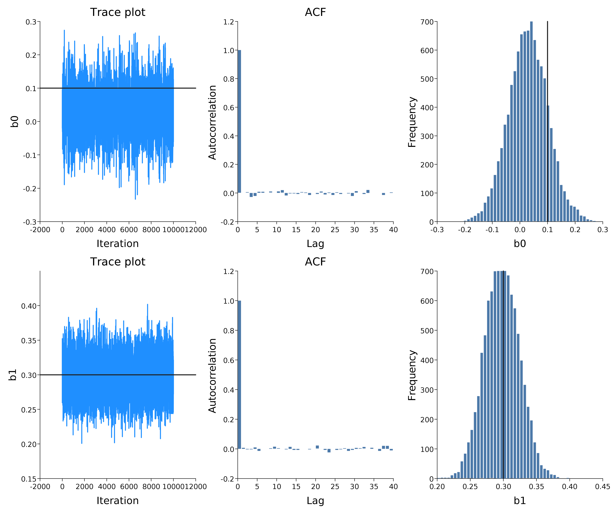
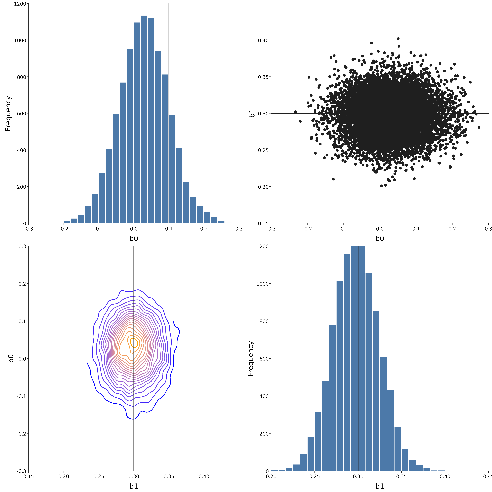

# Monadic probabilistic programming in Scala with Rainier

## Introduction

[Rainier](https://github.com/stripe/rainier) is an interesting new probabilistic programming library for Scala recently open-sourced by [Stripe](https://stripe.com/). Probabilistic programming languages provide a computational framework for building and fitting Bayesian models to data. There are many interesting probabilistic programming languages, and there is currently a lot of interesting innovation happening with probabilistic programming languages embedded in strongly typed functional programming languages such as Scala and Haskell. However, most such languages tend to be developed by people lacking expertise in statistics and numerics, leading to elegant, composable languages which work well for toy problems, but don't scale well to the kinds of practical problems that applied statisticians are interested in. Conversely, there are a few well-known probabilistic programming languages developed by and for statisticians which have efficient inference engines, but are hampered by inflexible, inelegant languages and APIs. Rainier is interesting because it is an attempt to bridge the gap between these two worlds: it has a functional, composable, extensible, monadic API, yet is backed by a very efficient, high-performance scalable inference engine, using [HMC](https://en.wikipedia.org/wiki/Hamiltonian_Monte_Carlo) and a static compute graph for reverse-mode [AD](https://en.wikipedia.org/wiki/Automatic_differentiation). Clearly there will be some loss of generality associated with choosing an efficient inference algorithm (eg. for HMC, there needs to be a fixed number of parameters and they must all be continuous), but it still covers a large proportion of the class of hierarchical models commonly used in applied statistical modelling.

In this post I'll give a quick introduction to Rainier using an interactive session requiring only that [SBT](https://www.scala-sbt.org/) is installed and the [Rainier repo](https://github.com/stripe/rainier) is downloaded or cloned.

## Interactive session

To follow along with this post, just run clone or download and unpack the Rainier repo, and run SBT from the top-level Rainier directory and paste commands. First start a Scala REPL.

```scala
project rainierCore
console
```

Before we start building models, we need some data. For this post we will focus on a simple logistic regression model, and so we will begin by simulating some synthetic data consistent with such a model.

```scala
val r = new scala.util.Random(0)
val N = 1000
val beta0 = 0.1
val beta1 = 0.3
val x = (1 to N) map { i =>
  3.0 * r.nextGaussian
}
val theta = x map { xi =>
  beta0 + beta1 * xi
}
def expit(x: Double): Double = 1.0 / (1.0 + math.exp(-x))
val p = theta map expit
val y = p map (pi => if (r.nextDouble < pi) 1 else 0)
```

Now we have some synthetic data, we can fit the model and see if we are able to recover the "true" parameters used to generate the synthetic data. In Rainier, we build models by declaring probabilistic programs for the model and the data, and then run an inference engine to generate samples from the posterior distribution.

Start with a bunch of Rainier imports:

```scala
import com.stripe.rainier.compute._
import com.stripe.rainier.core._
import com.stripe.rainier.sampler._
import com.stripe.rainier.repl._
```

Now we want to build a model. We do so by describing the joint distribution of parameters and data. Rainier has a few built-in distributions, and these can be combined using standard functional monadic combinators such as `map`, `zip`, `flatMap`, etc., to create a probabilistic program representing a probability monad for the model. Due to the monadic nature of such probabilistic programs, it is often most natural to declare them using a `for`-expression.

```scala
val model = for {
  beta0 <- Normal(0, 5).param
  beta1 <- Normal(0, 5).param
  _ <- Predictor.from{x: Double =>
      {
        val theta = beta0 + beta1 * x
        val p = Real(1.0) / (Real(1.0) + (Real(0.0) - theta).exp)
        //Binomial(p,1)
        Bernoulli(p)
      }
    }.fit(x zip y)
} yield Map("b0"->beta0, "b1"->beta1)
```

This kind of construction is very natural for anyone familiar with monadic programming in Scala, but will no doubt be a little mysterious otherwise. `RandomVariable` is the probability monad used for HMC sampling, and these can be constructed from `Distributions` using `.param` (for unobserved parameters) and `.fit` (for variables with associated observations). `Predictor` is just a convenience for observations corresponding to covariate information. `model` is therefore a `RandomVariable` over `beta0` and `beta1`, the two unobserved parameters of interest. Note that I briefly discussed this kind of pure functional approach to describing probabilistic programs (using `Rand` from [Breeze](https://github.com/scalanlp/breeze)) in my post on [MCMC as a stream](https://darrenjw.wordpress.com/2017/04/01/mcmc-as-a-stream/).

Now we have our probabilistic program, we can sample from it using HMC as follows.

```scala
implicit val rng = ScalaRNG(3)
val its = 10000
val thin = 5
val out = model.sample(HMC(5), 10000, its*thin, thin)
println(out.take(10))
```

The argument to `HMC()` is the number of leapfrog steps to take per iteration.

Finally, we can use EvilPlot to look at the HMC output and check that we have managed to reasonably recover the true parameters associated with our synthetic data.

```scala
import com.cibo.evilplot.geometry.Extent
import com.stripe.rainier.plot.EvilTracePlot._

render(traces(out, truth = Map("b0" -> beta0, "b1" -> beta1)),
  "traceplots.png", Extent(1200, 1000))
render(pairs(out, truth = Map("b0" -> beta0, "b1" -> beta1)), "pairs.png")
```




Everything looks good, and the sampling is very fast!

## Further reading

For further information, see the [Rainier repo](https://github.com/stripe/rainier). In particular, start with the [tour of Rainier's core](https://github.com/stripe/rainier/blob/master/docs/tour.md), which gives a more detailed introduction to how Rainier works than this post. Those interested in how the efficient AD works may want to read about the [compute graph](https://github.com/stripe/rainier/blob/master/docs/real.md), and the [implementation notes](https://github.com/stripe/rainier/blob/master/docs/impl.md) explain how it all fits together. There is some basic ScalaDoc for the core package, and also some [examples](https://github.com/stripe/rainier/tree/master/rainier-example/src/main/scala/com/stripe/rainier/example) (including this one), and there's a [gitter channel](https://gitter.im/com_stripe_rainier/Lobby) for asking questions. This is a very new project, so there are a few minor bugs and wrinkles in this initial release, but development is progressing rapidly, so I fully expect the library to get properly battle-hardened over the next few months.

For those unfamiliar with the monadic approach to probabilistic programming, then [Ścibior et al (2015)](http://mlg.eng.cam.ac.uk/pub/pdf/SciGhaGor15.pdf) is probably a good starting point.


#### eof

