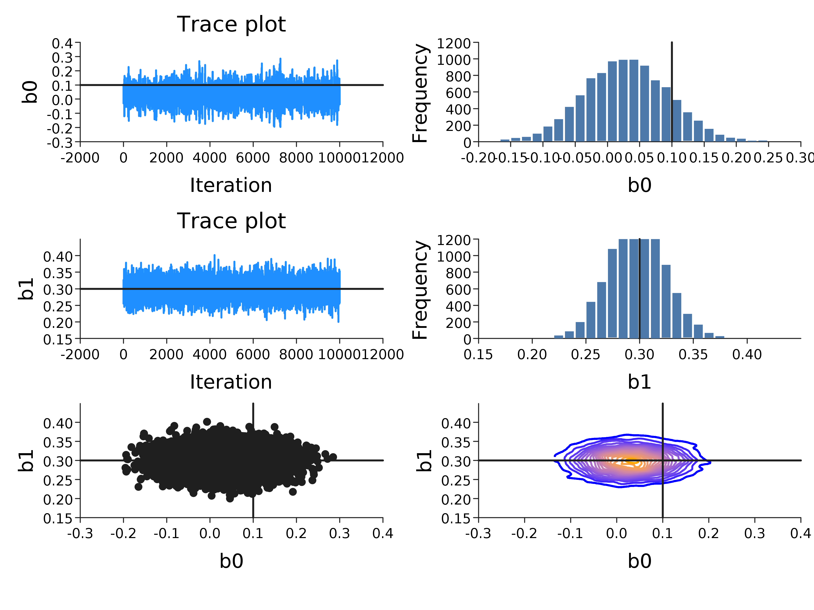

# Monadic probabilistic programming in Scala with Rainier

## Introduction

[Rainier](https://github.com/stripe/rainier) is an interesting new probabilistic programming library for Scala recently open-sourced by [Stripe](https://stripe.com/). Probabilistic programming languages provide a computational framework for building and fitting Bayesian models to data. There are many interesting probabilistic programming languages, and there is currently a lot of interesting innovation happening with probabilistic programming languages embedded in strongly typed functional programming languages such as Scala and Haskell. However, most such languages tend to be developed by people lacking expertise in statistics and numerics, leading to elegant, composable languages which work well for toy problems, but don't scale well to the kinds of practical problems that applied statisticians are interested in. Conversely, there are a few well-known probabilistic programming languages developed by and for statisticians which have efficient inference engines, but are hampered by inflexible, inelegant languages and APIs. Rainier is interesting because it is an attempt to bridge the gap between these two worlds: it has a functional, composable, extensible, monadic API, yet is backed by a very efficient, high-performance scalable inference engine, using [HMC](https://en.wikipedia.org/wiki/Hamiltonian_Monte_Carlo) and a static compute graph for reverse-mode [AD](https://en.wikipedia.org/wiki/Automatic_differentiation).

In this post I'll give a quick introduction to Rainier using an interactive session requiring only that [SBT](https://www.scala-sbt.org/) is installed.

## Interactive session

To follow along with this post, just run SBT from an empty directory and paste commands. First set some dependencies and start a Scala REPL.

```scala
set libraryDependencies += "com.stripe" %% "rainier-core" % "0.1.0"
set libraryDependencies += "com.cibo" %% "evilplot" % "0.2.0"
set resolvers += Resolver.bintrayRepo("cibotech", "public")
set scalaVersion := "2.12.4"
console
```

I've included a dependency on [EvilPlot](https://cibotech.github.io/evilplot/), (discussed in the [previous post](https://darrenjw.wordpress.com/2018/05/11/using-evilplot-with-scala-view/)), so we can plot some MCMC diagnostics later.

At the Scala REPL, start with a bunch of Rainier imports:

```scala
import com.stripe.rainier.compute._
import com.stripe.rainier.core._
import com.stripe.rainier.sampler._
import com.stripe.rainier.repl._
```

Before we start building models, we need some data. For this post we will focus on a simple logistic regression model, and so we will begin by simulating some synthetic data consistent with such a model.

```scala
val r = new scala.util.Random(0)
val N = 1000
val beta0 = 0.1
val beta1 = 0.3
val x = (1 to N) map { i =>
  3.0 * r.nextGaussian
}
val theta = x map { xi =>
  beta0 + beta1 * xi
}
def expit(x: Double): Double = 1.0 / (1.0 + math.exp(-x))
val p = theta map expit
val y = p map (pi => if (r.nextDouble < pi) 1 else 0)
```

Now we have some synthetic data, we can fit the model and see if we are able to recover the "true" parameters used to generate the synthetic data. In Rainier, we build models by declaring probabilistic programs for the model and the data, and then run an inference engine to generate samples from the posterior distribution.

```scala
case class Bernoulli(p: Real) extends Distribution[Int] {

  def logDensity(b: Int): Real = {
    p.log * b + (Real.one - p).log * (1 - b)
  }

  val generator = Generator.from { (r, n) =>
    val pd = n.toDouble(p)
    val u = r.standardUniform
    if (u < pd) 1 else 0
  }

}
```


https://darrenjw.wordpress.com/2017/04/01/mcmc-as-a-stream/


```scala
val model = for {
  beta0 <- Normal(0, 5).param
  beta1 <- Normal(0, 5).param
  _ <- Predictor.from{x: Double =>
      {
        val theta = beta0 + beta1 * x
        val p = Real(1.0) / (Real(1.0) + (Real(0.0) - theta).exp)
        //Binomial(p,1)
        Bernoulli(p)
      }
    }.fit(x zip y)
} yield (beta0, beta1)
```

```scala
implicit val rng = ScalaRNG(3)
val its = 10000
val thin = 5
val out = model.sample(HMC(5), 10000, its*thin, thin)
println(out.take(10))
```


```scala
import com.cibo.evilplot.plot._
import com.cibo.evilplot.colors._
import com.cibo.evilplot.plot.aesthetics.DefaultTheme._
import com.cibo.evilplot.numeric.Point

val data = out.map(_._1).zipWithIndex.map(p => Point(p._2,p._1))
val trace = LinePlot.series(data, "Line graph", HSL(210, 100, 56)).
  xAxis().yAxis().frame().hline(beta0).
  xLabel("Iteration").yLabel("b0").title("Trace plot")
val hist = Histogram(out.map(_._1),30).xAxis().yAxis().frame().
  xLabel("b0").yLabel("Frequency").vline(beta0)
val data1 = out.map(_._2).zipWithIndex.map(p => Point(p._2,p._1))
val trace1 = LinePlot.series(data1, "Line graph", HSL(210, 100, 56)).
  xAxis().yAxis().frame().hline(beta1).
  xLabel("Iteration").yLabel("b1").title("Trace plot")
val hist1 = Histogram(out.map(_._2),30).xAxis().yAxis().frame().
  xLabel("b1").yLabel("Frequency").vline(beta1)
val scatter = ScatterPlot(out.map(p => Point(p._1,p._2))).
  xAxis().yAxis().frame().vline(beta0).hline(beta1).
  xLabel("b0").yLabel("b1")
val contour = ContourPlot(out.map(p => Point(p._1,p._2))).
  xAxis().yAxis().frame().vline(beta0).hline(beta1).
  xLabel("b0").yLabel("b1")
val plot = Facets(Seq(Seq(trace,hist),Seq(trace1,hist1),Seq(scatter,contour)))
javax.imageio.ImageIO.write(plot.render().asBufferedImage, "png",
  new java.io.File("diagnostics.png"))
```



#### eof

