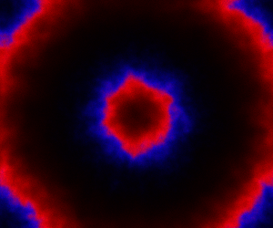
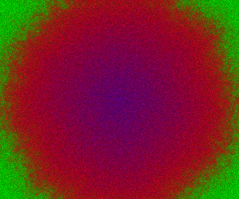

# Stochastic reaction-diffusion modelling

## Introduction

There is a fairly large literature on [reaction-diffusion modelling](https://en.wikipedia.org/wiki/Reaction%E2%80%93diffusion_system) using [partial differential equations](https://en.wikipedia.org/wiki/Partial_differential_equation) (PDEs). There is also a fairly large literature on [stochastic modelling of coupled chemical reactions](https://en.wikipedia.org/wiki/Gillespie_algorithm), which account for the discreteness of reacting species at low concentrations. There is some literature on combining the two, to form stochastic reaction-diffusion systems, but this literature is much smaller.

In this post we will look at one approach to the stochastic reaction-diffusion problem, based on an underlying stochastic process often described by the *reaction diffusion master equation* (RDME). We will start by generating exact realisations from this process using the *spatial Gillespie algorithm*, before switching to a continuous stochastic approximation often known as the [*spatial chemical Langevin equation*](https://dx.doi.org/10.1186%2Fs12976-015-0001-6) (spatial CLE). For fine discretisations, this spatial CLE is just an explicit numerical scheme for an associated reaction-diffusion *stochastic partial differential equation* (SPDE), and we can easily contrast such SPDE dynamics with their deterministic PDE approximation. We will investigate using simulation, based on my Scala library, [scala-smfsb](https://github.com/darrenjw/scala-smfsb), which accompanies the third edition of my textbook, [Stochastic modelling for systems biology](https://github.com/darrenjw/smfsb), as discussed in [previous](https://darrenjw.wordpress.com/2018/12/19/stochastic-modelling-for-systems-biology-third-edition/) [posts](https://darrenjw.wordpress.com/2019/01/04/the-scala-smfsb-library/).

All of the code used to generate the plots and movies in this post is available in my [blog repo](https://github.com/darrenjw/blog/tree/master/reaction-diffusion).

## The Lotka-Volterra reaction network

### Exact simulation from the RDME

My favourite toy coupled chemical reaction network is the [Lotka-Volterra](https://en.wikipedia.org/wiki/Lotka%E2%80%93Volterra_equations) predator-prey system, presented as the three reactions

$$X \longrightarrow 2X$$
$$X + Y \longrightarrow 2Y$$
$$Y \longrightarrow \emptyset$$

with $X$ representing the *prey* species and $Y$ the *predator*. I showed how to simulate realisations from this process using the Scala library in the [previous post](https://darrenjw.wordpress.com/2019/01/04/the-scala-smfsb-library/). Here we will consider simulation of this model in 2d, and simulate exact realisation from the appropriate RDME using the spatial Gillespie algorithm. Full runnable code for this simulation is [here](https://github.com/darrenjw/blog/blob/master/reaction-diffusion/src/main/scala/rd/LvExact.scala), but the key lines are:
```scala
val r = 100; val c = 120
val model = SpnModels.lv[IntState]()
val step = Spatial.gillespie2d(model, DenseVector(0.6, 0.6), maxH=1e12)
val x00 = DenseVector(0, 0)
val x0 = DenseVector(50, 100)
val xx00 = PMatrix(r, c, Vector.fill(r*c)(x00))
val xx0 = xx00.updated(c/2, r/2, x0)
val s = Stream.iterate(xx0)(step(_,0.0,0.1))
```
which sets up an infinite lazy `Stream` of states on a 100x120 grid over time steps of 0.1 units with diffusion rates of 0.6 for both species. We can then map this to a stream of images and visualise it using my [scala-view](https://github.com/darrenjw/scala-view) library (described in [this post](https://darrenjw.wordpress.com/2018/03/01/scala-view-animate-streams-of-images/)). Running gives the following output:

FRAME AND MOVIE HERE

The above image is the final frame of a movie which can be viewed by clicking on the image. In the simulation, blue represents the prey species, $X$, and red represents the predator, $Y$. The simulation is initialised with a few prey and predators in the central pixel. At each time step of the simulation, either a reaction or a diffusion event may occur. If diffusion occurs, an individual moves from its current location to one of the four adjacent pixels. This algorithm is extremely computationally intensive, however well it is implemented. The implementation used here (using the function `Spatial.gillespie2d` in the `scala-smfsb` library) is quite inefficient. A more efficient implementation would use the [next subvolume method](https://ieeexplore.ieee.org/abstract/document/1389215) or similar algorithm. But since every reaction event is simulated sequentially, this algorithm is always going to be intolerably slow for most interesting problems.

### The spatial CLE

The spatial CLE effectively approximates the true RDME dynamics with a set of coupled SDEs on the spatial grid. This can be interpreted as an explicit scheme for numerically integrating an SPDE. But this numerical scheme is *much* more efficient, allowing sensible time-stepping of the process, and vectorises and parallelises nicely. The details are in my book, but the Scala implementation is [here](https://github.com/darrenjw/scala-smfsb/blob/3251b804d447df35a38076a03dfb679e6e09af55/src/main/scala/smfsb/Spatial.scala#L285). Diffusion is implemented efficiently and in parallel using the comonadic approach that I've [described previously](https://darrenjw.wordpress.com/2018/01/22/comonads-for-scientific-and-statistical-computing-in-scala/). We can quickly and easily generate large simulations using the spatial CLE. Here is a movie generated on a 250x300 grid.

[](lv-cle.mp4)

Again, clicking on the final frame should give the movie. We see that although the quantitative details are slightly different to the exact algorithm, the essential qualitative behaviour of the system is captured well by the spatial CLE. Full code for this simulation is [here](https://github.com/darrenjw/blog/blob/master/reaction-diffusion/src/main/scala/rd/LvCle.scala)

### Reaction-diffusion PDE

If we remove all of the noise terms from the spatial CLE, we get a set of coupled ODEs, which again, may be interpreted as a numerical scheme for integrating a reaction-diffusion PDE model. Below are the dynamics on the same 250x300 grid.

[](lv-rre.mp4)

It seems a bit harsh to describe a reaction-diffusion PDE as "boring", but it certainly isn't as interesting as the stochastic dynamics. Also, it has qualitatively quite different behaviour to the stochastic models, with wavefronts being less pronounced and less well separated.

### Other initialisations

[](lv-cle2.mp4)

[](lv-rre2.mp4)

[](lv-cle3.mp4)

[](lv-rre3.mp4)


## The SIR model

Let's now turn attention to a spatial epidemic process model, the spatial susceptible-infectious-recovered model. Again, we'll start from the discrete reaction formulation.

$$S + I \longrightarrow 2I$$
$$I \longrightarrow R$$

I'll add this model to the next release of `scala-smfsb`, but in the meantime we can easily define it ourselves with:
```scala
def sir[S: State](p: DenseVector[Double] = DenseVector(0.1, 0.5)): Spn[S] =
  UnmarkedSpn[S](
    List("S", "I", "R"),
    DenseMatrix((1, 1, 0), (0, 1, 0)),
    DenseMatrix((0, 2, 0), (0, 0, 1)),
    (x, t) => {
      val xd = x.toDvd
      DenseVector(
        xd(0) * xd(1) * p(0), xd(1) * p(1)
      )}
  )
```
We can seed a simulation with a few infectious individuals in the centre of a roughly homogeneous population of susceptibles.

## Spatial CLE

This time we'll skip the exact simulation, since it's very slow, and go straight to the spatial CLE. A simulation on a 250x300 grid is given below.

[](sir-cle.mp4)

Here, green represents $S$, red $I$ and blue $R$. In this simulation, $I$ diffuses more slowly than $S$, and $R$ doesn't diffuse at all.

## PDE model

If we ditch the noise to get a reaction-diffusion PDE model, the dynamics are as follows.

[](sir-rre.mp4)

Again, we see that the deterministic model is quite different to the stochastic version, and kind-of boring.

## Further reading

All of the code used to generate the plots and movies in this post is available in an easily runnable form in my [blog repo](https://github.com/darrenjw/blog/tree/master/reaction-diffusion). Further details relating to stochastic reaction-diffusion modelling based on the RDME can be found in Chapter 9 of my textbook, [Stochastic modelling for systems biology, third edition](https://github.com/darrenjw/smfsb).


#### eof

